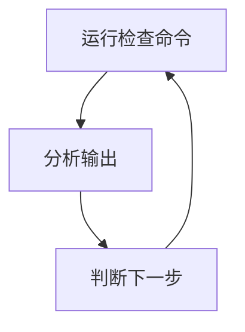

在自动化运维工作中，puppet, ansible等工具有效的解决了系统部署问题，但是在日常维护方面，个人觉得这些工具还是显得太重了，要想熟练使用他们相当于要系统学习一门新的语言。特别是针对一些不能随便安装软件包的主机，或者非Linux的Unix主机，这些热门的自动化运维工具使用起来受的局限较多，fsmexpect正是诞生于这种局限。

<!--more-->

## 简介

fsmexpect的目的是实现对系统的普适性，其仅仅依赖于Unix操作系统的ssh和scp命令。pexpect模块内嵌其中，因此对python库也没有任何要求。

fsmexpect通过有限状态机(FSM)模型定义日常维护过程中最常见的工作模式：



## 下载地址

[https://github.com/lprincewhn/fsmexpect/releases/latest](https://github.com/lprincewhn/fsmexpect/releases/latest)

## 原理

FSMState是FSM的调度单元，目前FSMState有4种类型：
- command, 进入该状态将向远程主机发送命令，发送以换行符结束，表示执行命令。
- operate, 进入该状态将向远程主机发送单一的字符，用于响应远程主机的一些交互操作，如“按任意键显示下一页”
- end, 进入该状态表示FSM的整个调度过程成功结束。
- exception, 进入该状态表示FSM运行失败，抛出表示失败原因的异常。

每个FSMState对象表示FSM种的一个状态，FSM将通过执行命令并分析输出后触发状态的迁移，而状态迁移后将触发新的命令执行。
下图是一个运行特权命令（可能需要密码）的FSM：


**State 1.** 该状态将所需要运行的命令发送到远程主机并执行，在输出结果种查找预期的输出字符串，并根据以下条件进行状态迁移：
  - State 2, 输出结果提示需要密码，如找到“Passwrod: ”。
  - State 3, 输出结果表示结果有多页，如“--More--(xx%)”。
  - State 4, 输出结果包含了一个shell提示符。

**State 2.** 该状态将密码发送到远程主机，并根据以下条件进行状态迁移：
  - State 3, 密码正确，输出结果表示结果还有其他页，如“--More--(xx%)”。
  - State 4, 密码正确，输出结果包含了一个shell提示符。
  - State 5, 输出结果提示密码错误，如“su: Authentication failure”。

**State 3.** 该状态将向远程主机发送一个字符，指示远程主机打印下一页结果，并根据以下条件进行状态迁移：
  - State 3, 输出结果表示结果还有其他页，如“--More--(xx%)”。
  - State 4, 输出结果包含了一个shell提示符。

**State 4.** 该状态表示FSM运行成功。

**State 5.** 该状态表示FSM运行失败，抛出认证失败异常表示密码错误。

以下为定义该FSM的代码：

``` python
cmd_state = fsmexpect.FSMState("command", cmd)
succ_state= fsmexpect.FSMState("end")
pass_state = fsmexpect.FSMState("command", password)
fail_state = fsmexpect.FSMState("exception", AuthenticationFailed())
continue_state = fsmexpect.FSMState("operate", " ")
cmd_state.add_next_state(shell_prompt, succ_state)                 # Success directly
cmd_state.add_next_state('.+assword:', pass_state)                 # Need password
cmd_state.add_next_state('--More--\(\d+%\)', continue_state)       # Long output
pass_state.add_next_state(shell_prompt, succ_state)                # Success directly
pass_state.add_next_state("Authentication failure", fail_state)    # Wrong password
pass_state.add_next_state('--More--\(\d+%\)', continue_state)      # Long output
continue_state.add_next_state(shell_prompt, succ_state)
continue_state.add_next_state('--More--\(\d+%\)', continue_state)
output = cmd_state.start(self.ssh, timeout)
```
